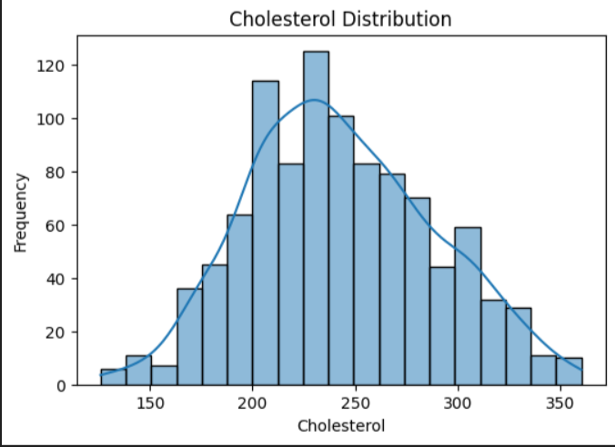
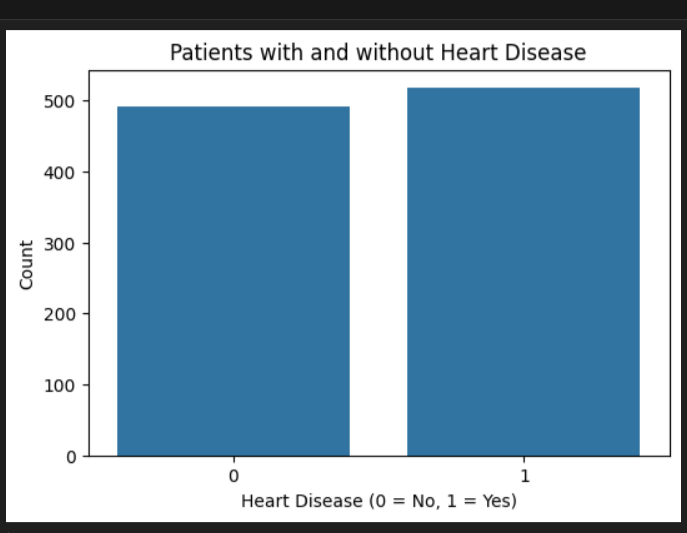

# Heart-Disease-Data-Analysis
This project focuses on analyzing heart disease data to uncover insights and patterns that can help in understanding factors related to heart health. The analysis is done using Python libraries like Pandas, NumPy, Matplotlib, and Seaborn.

## Project Overview
The goal of this project is to:
- Load and preprocess heart disease data.
- Handle missing values and remove outliers.
- Perform statistical analysis and data exploration.
- Visualize the data to find trends and relationships.

## Libraries Used
- `Pandas`: Data loading, cleaning, and manipulation.
- `NumPy`: Numerical computations and reshaping data.
- `Matplotlib`: Data visualization.
- `Seaborn`: Advanced visualizations and statistical plots.

## Steps Performed
### 1. Data Loading & Preprocessing
- Loaded the dataset and displayed its structure.
- Checked and handled missing values using imputations.
- Removed outliers from at least one column.
- Checked data shape before and after imputation.

### 2. Numerical Analysis (Using NumPy & Pandas)
- Computed statistics like mean, median, and standard deviation for key indicators.
- Calculated minimum and maximum values for heart rate.
- Sorted and searched patients based on cholesterol levels.
- Identified patients with high cholesterol above 300 mg/dL.
- Found patients older than 60 with abnormal ECG results.
- Reshaped and split the data using NumPy functions.

### 3. Data Visualization (Using Matplotlib & Seaborn)
- Visualized the distribution of key medical indicators.
- Created scatter plots and histograms for data exploration.
- Compared trends between different patient groups.

## How to Run the Project
1. Make sure Python is installed.
2. Install the required libraries:
    ```bash
    pip install pandas numpy matplotlib seaborn
    ```
3. Open the project folder and run the Jupyter Notebook.

## Dataset
- The dataset used contains information about patients' medical history and heart conditions.

## Results & Insights
- Identified strong correlations between cholesterol, heart rate, and heart disease.
- Highlighted the importance of early detection of abnormal ECG readings.
- 
- 
- 
- 
- 
